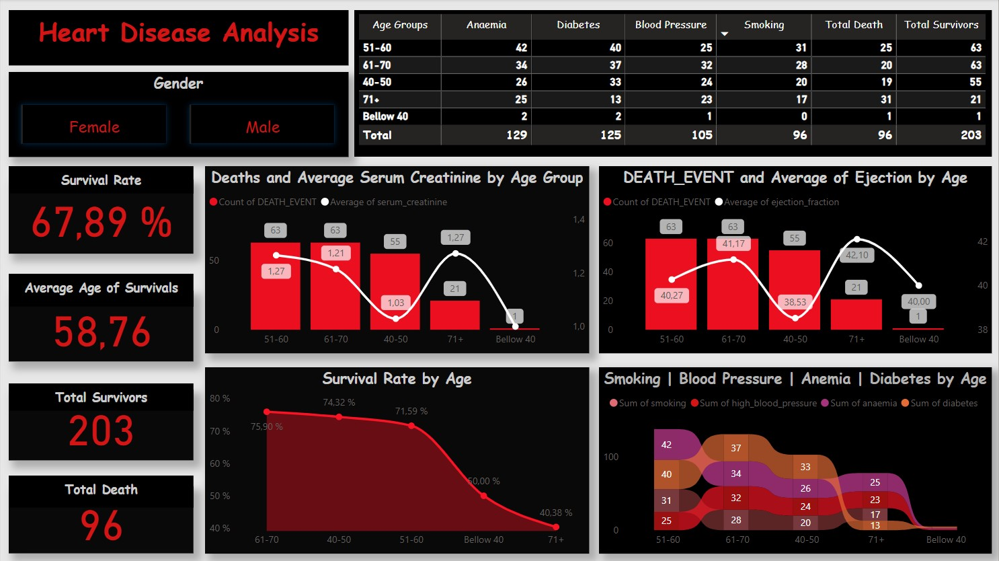

# 📊 Heart Disease Analysis Dashboard
This project presents an interactive Power BI dashboard for analyzing heart disease patient data. It aims to provide meaningful insights into survival rates, mortality factors, and key medical indicators across different demographics.

# ✅ Dashboard Highlights:
Overall Survival Rate: Displays the percentage of patients who survived.

Average Age of Survivors: Shows the average age of those who survived heart disease.

Total Survivors and Deaths: Key metrics highlighting patient outcomes.

Gender Filter: Allows filtering of the entire report by gender (Male/Female).

Detailed Age Group Analysis:

Deaths & Serum Creatinine Levels: Visualizes the count of deaths and average serum creatinine levels by age group.

Deaths & Ejection Fraction: Shows death count alongside the average ejection fraction by age group.

Survival Rate by Age: Illustrates survival percentages across different age groups.

Risk Factors Distribution: Compares major health risk factors—smoking, high blood pressure, anemia, and diabetes—by age group.

Summary Table: Provides aggregated counts of risk factors, deaths, and survivals for each age group.

# ✅ Key Features:
Modern dark-themed UI with a bold red color palette for strong contrast.

Fully interactive with slicers and dynamic visual updates.

Combines bar charts, line charts, and flow diagrams for comprehensive data storytelling.

Optimized for healthcare decision-makers and medical researchers.

# ✅ Technologies Used:
Power BI Desktop

DAX Measures & Calculations

Data Visualization Best Practices

# ✅ Possible Improvements (Planned Enhancements):
Dynamic titles based on filter selection.

Enhanced color distinction for overlapping categories.

Additional drill-down options by medical conditions.

# ✅ How to Use:
Clone this repository.

Open the .pbix file in Power BI Desktop.

Explore the dashboard by applying filters and interacting with visual elements.
